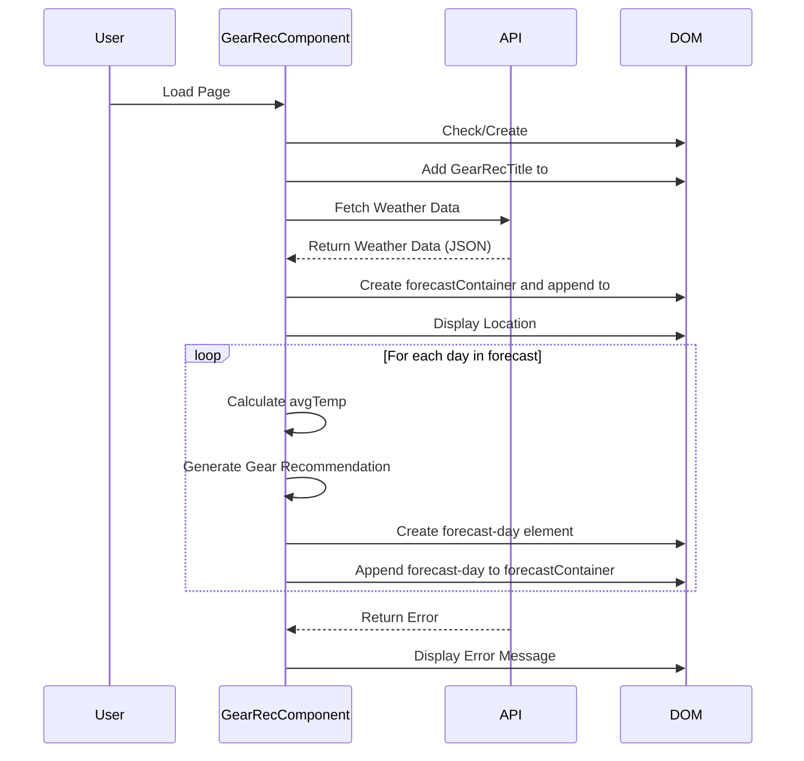

## Feature: Gear Recommendation

This feature grabs from weather currently a fake api (will implement with real one in milestone 4) 
with a given location that is provided and displays it on the screen. This feature also takes the average of the
low and high temperatures and recommends gear that the user should bring.

# Sequence Diagram
