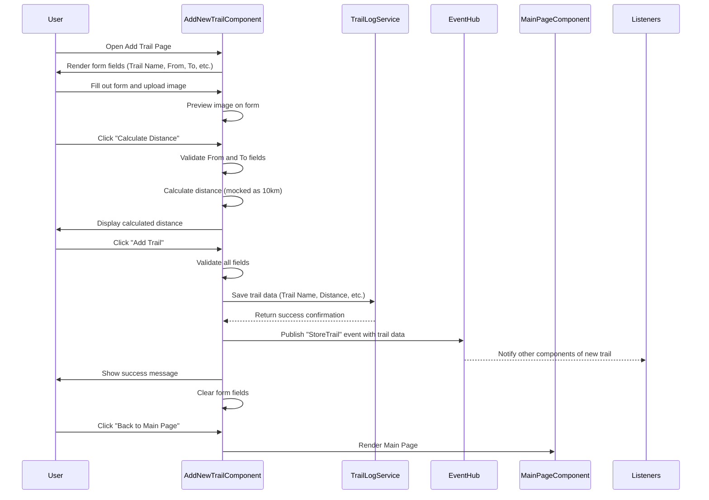

## Feature: Add New Trails Page

The Add New Trails feature allows users to add and save details about their favorite trails. Users can input the trail name, start and end locations, upload an image, and calculate the distance between locations. All data is validated before being saved, ensuring accurate and organized trail information.

# Sequence Diagram

