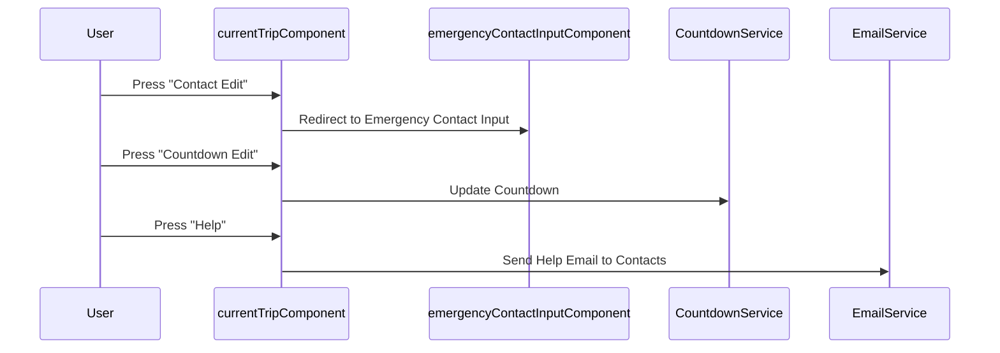

## Feature: Current Trip Information

Acknowledge user about the remaining time they aim to reach the destination. Users can edit the remaining time, edit the contact list and press "HELP" button to immediately email emergency contact.

