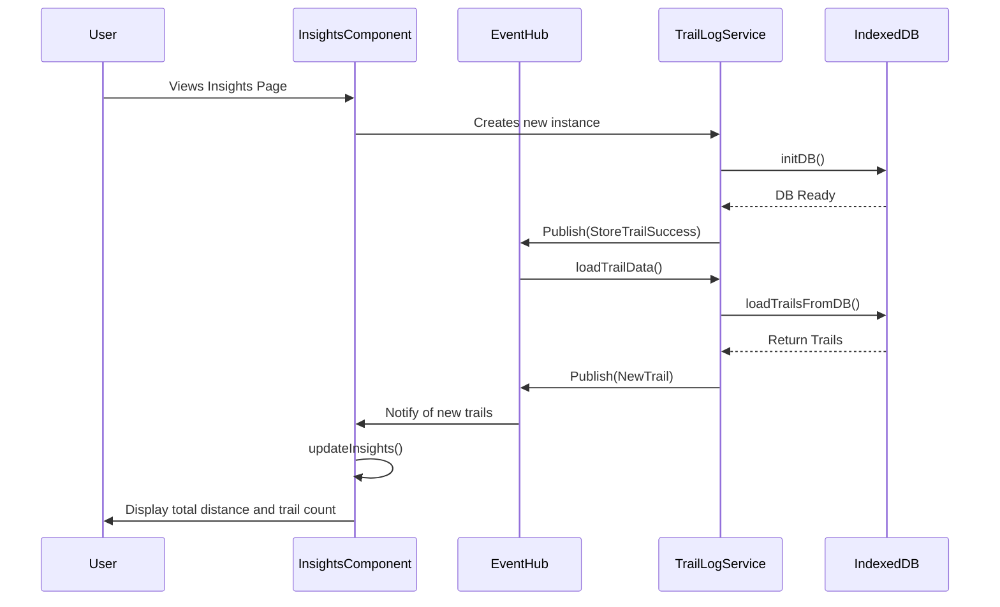

## Feature: TrailSafe Insights

This feature retrieves trail data on the hikers previous saved trails using indexedDB. It uses this data 
to create a visualization dashboard that shows insights to the hiker. Relevant fields show insights such as
"total mileage hiked" and "trails completed. 

